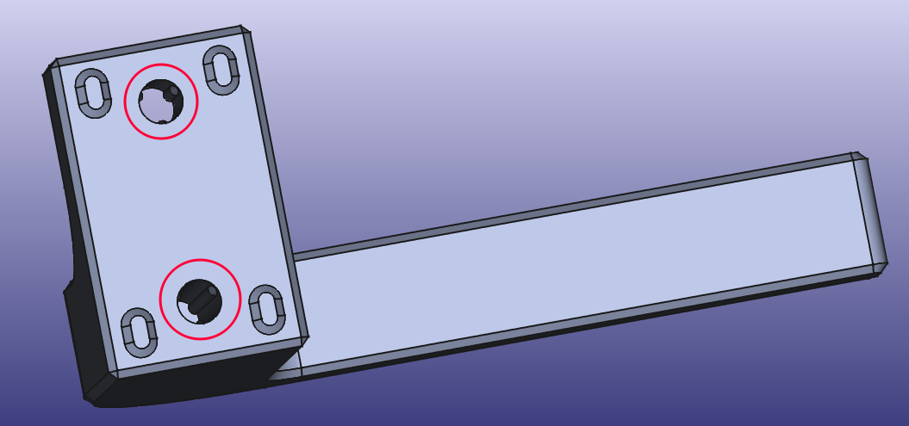
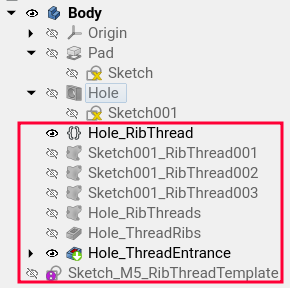

**_Info:_** _I have incorporated this macro into my upcoming [FusedFilamentDesign](https://github.com/Rahix/FusedFilamentDesign) FreeCAD addon! :)_

`RibThreads.FCMacro`
====================
A macro to automatically generate the geometry for [rib thread forming][1]
(Rule **R5.4** from my [Design for 3D-Printing][2] guide).

## Usage
First, create a normal [Hole][3] feature for the rib threads in the active
[PartDesign body][4].  Select one of the predefined thread sizes (e.g. `M5`).
Also, you need to select `Threaded`, as if you intended to later cut threads
with a thread tap.

Then, select the Hole and execute this macro.  It will generate a few new objects:

- `Hole_RibThread` is a VarSet to control a few parameters:
  * Hole entrance depth and diameter.  This is the region before the ribs start.
  * Rib rotation angle.  You may need to adjust this when printing the ribs
    sideways so there is no free-hanging rib at the top of the hole.
- At the document root, a global `Sketch_M5_RibThreadTemplate` is created which
  will be referenced by all rib threads of this thread size in the document.
  You shouldn't need to adjust this, but if you need to tweak the threads after
  creation, this would be the place.
- `Sketch001_RibThread001`, ...: Shape binders to get the template in place.

**Important**: I have not yet had time to verify all the thread parameters on
real 3d-printed parts.  I wanted to get this published anyway, so you may face
a warning popup about untested parameters.  Please go ahead and try them
anyway!  And ideally, let me know if the parameters work or need adjustment, so
I can update the macro accordingly :)

## Parametric Properties
The following changes will lead to automatic adjustment of the rib threads:

- Moving the Sketch of the original Hole
- Moving the circles inside the Sketch of the original Hole
- Changing the settings in the VarSet for the rib threads
- Changing the depth of the original Hole

The following changes will **not** be followed.  Instead you will need to
delete the shape-binders and pocket features of the rib-thread and re-run the
macro:

- Adding or removing circles in the Sketch of the original Hole
- Changing the thread size of the Hole

You do not have to delete the template sketches.  If you leave the VarSet in
place, it will not be overwritten.  This may be useful to keep the settings
intact after regeneration.

[1]: https://blog.rahix.de/design-for-3d-printing/#rib-thread-forming
[2]: https://blog.rahix.de/design-for-3d-printing/
[3]: https://wiki.freecad.org/PartDesign_Hole
[4]: https://wiki.freecad.org/PartDesign_Body
