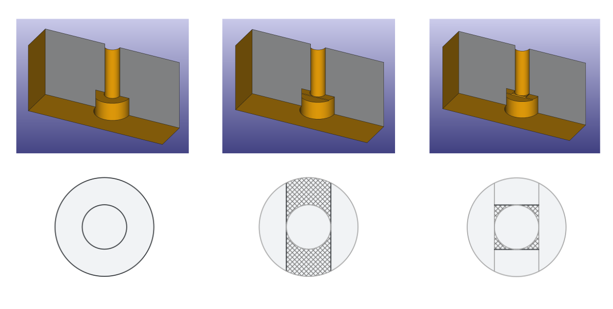

**_Info:_** _I have incorporated this macro into my upcoming [FusedFilamentDesign](https://github.com/Rahix/FusedFilamentDesign) FreeCAD addon! :)_

`UpsideDownCounterbore.FCMacro`
===============================
A macro to automatically build the geometry for the [overhanging counterbore
trick][1] (Rule **R3.5** from my [Design for 3D-Printing][2] guide).

## Usage
Select a [Hole][3] feature in the active [PartDesign body][4], then run the
macro.  This will add two additional Pocket features to make the necessary
cutouts, leaving only easily printable bridges behind.

The generated Pocket features and their sketches are fully parametric.  They
will automatically adjust when changing the settings of the original Hole or
moving the circles in the sketch of the Hole.

Adding or removing circles in the sketch of the Hole is not supported.  If
necessary, delete the generated Pocket features and re-run the macro.

## Layer Height
Currently, the layer height is hardcoded as a constant at the top of the macro
file (default value is `0.2 mm`).  If needed, please adjust it there.

[1]: https://blog.rahix.de/design-for-3d-printing/#the-overhanging-counterbore-trick
[2]: https://blog.rahix.de/design-for-3d-printing/
[3]: https://wiki.freecad.org/PartDesign_Hole
[4]: https://wiki.freecad.org/PartDesign_Body
